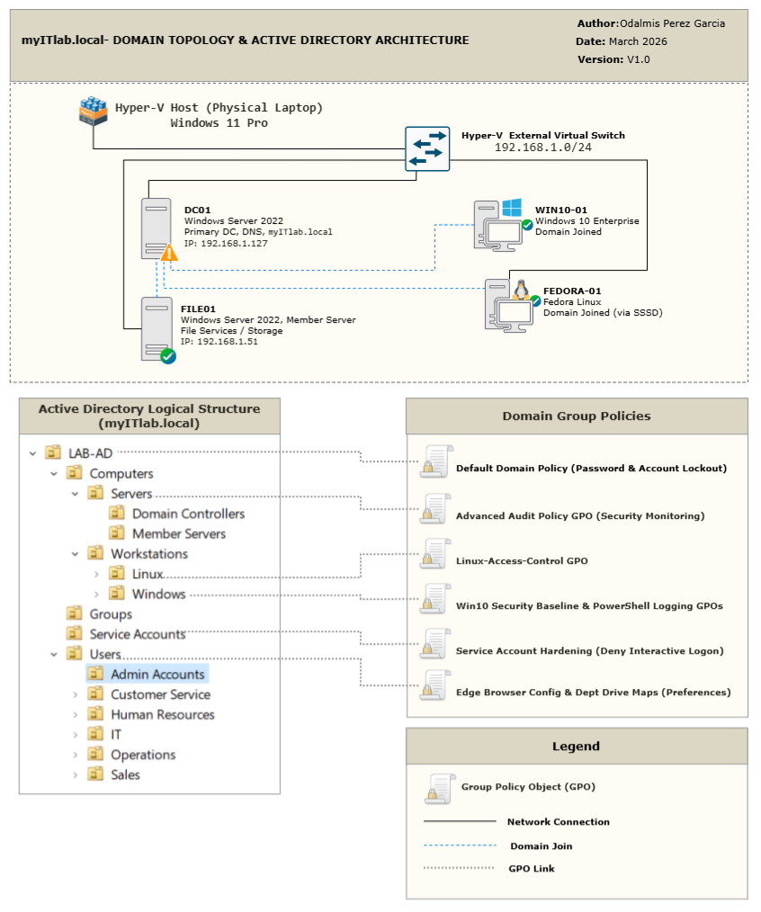

# Active Directory & Group Policy Home Lab (myITlab.local)
This repository documents my Windows Server 2022 Active Directory and Group Policy home lab, built to practice real-world IT support and system administration tasks and to use as a portfolio project.  

## Lab Overview

- Domain: `myITlab.local`
- Role: Windows Server 2022 domain controller, member servers, and Windows/Fedora clients
- Goal: Practice OU design, user/group management, Group Policy, security baselines, and auditing in a realistic small-business environment.

## Architecture & Domain Topology 

  

## What I Practiced

- Designed an OU structure for departments (IT, HR, Sales, etc.) and computers (servers, Windows, Linux).  
- Created users, admin accounts, and security groups following least privilege.  
- Built multiple GPOs for workstation/server hardening, login restrictions, and browser/security settings.  
- Configured Advanced Audit Policy and captured key security events for group changes and admin logons.  
- Integrated a Fedora Linux client with AD for centralized authentication and access control.

## Documentation

- [OU Design](docs/OU-Design.md)
- [GPO Projects](docs/GPO-Projects.md)
- [Auditing Evidence](docs/Auditing-Evidence.md)

## Screenshots

Screenshots of Group Policy Management Console, gpresult, and Event Viewer are stored in the `images/` folder and referenced from the docs.

