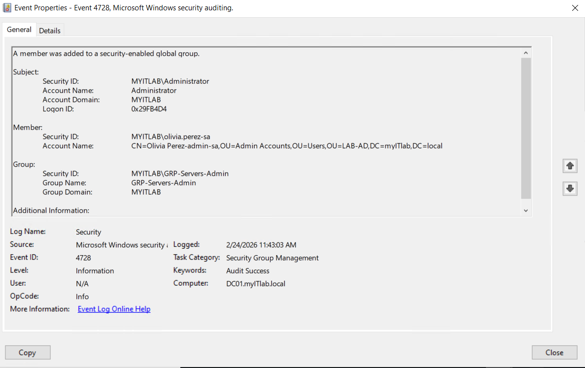
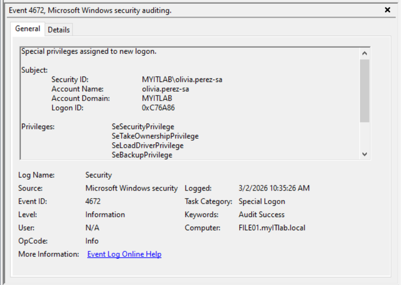

# Active Directory Security & Auditing Evidence

This document outlines the Advanced Audit Policy configurations implemented in the `myITlab.local` environment and provides evidence of successful security event logging. Auditing was configured to track privileged account usage and critical group modifications, aligning with CIS and NIST cybersecurity frameworks.

---

## 1. Privilege Escalation & Group Management (Event ID 4728)

**Goal:** Monitor critical Active Directory groups (like Domain Admins or Server Admins) to detect unauthorized privilege escalation.

*   **Audit Policy Applied:** `Audit Security Group Management` (Success and Failure)
*   **The Scenario:** A new admin account (`olivia.perez-sa`) was created following the principle of least privilege, and was added to the `GRP-Servers-Admin` global security group.
*   **Log Verification:** The Domain Controller successfully captured **Event ID 4728** ("A member was added to a security-enabled global group"). The log clearly details the *Subject* (who made the change), the *Member* (the account that was added), and the *Target Group*.

  
   
  <em>Evidence: Event Viewer on DC01 capturing a critical security group modification.</em>

---

## 2. Privileged Account Logon Tracking (Event ID 4624 & 4672)

**Goal:** Differentiate between standard user logons and highly privileged admin logons to establish a baseline for normal network behavior.

*   **Audit Policy Applied:** `Audit Logon` and `Audit Special Logon` (Success and Failure)
*   **The Scenario:** A Tier-1 Admin account logs into a server to perform maintenance tasks.
*   **Log Verification:** The system successfully logged **Event ID 4624** (Successful Logon) paired with **Event ID 4672** (Special Privileges Assigned to New Logon). This proves the auditing system correctly identifies when an account with administrative rights authenticates, allowing for immediate alerting in a SIEM environment.

  
   
  <em>Evidence: Event Viewer confirming an administrative (special) logon session.</em>

---

## Why This Matters
Implementing Advanced Audit Policies rather than basic auditing ensures that log files do not become overwhelmed with "noise." By targeting specific, high-fidelity Event IDs (like 4728 and 4672), this lab simulates an enterprise environment where security analysts can build accurate SIEM alerts for threat hunting and incident response.
