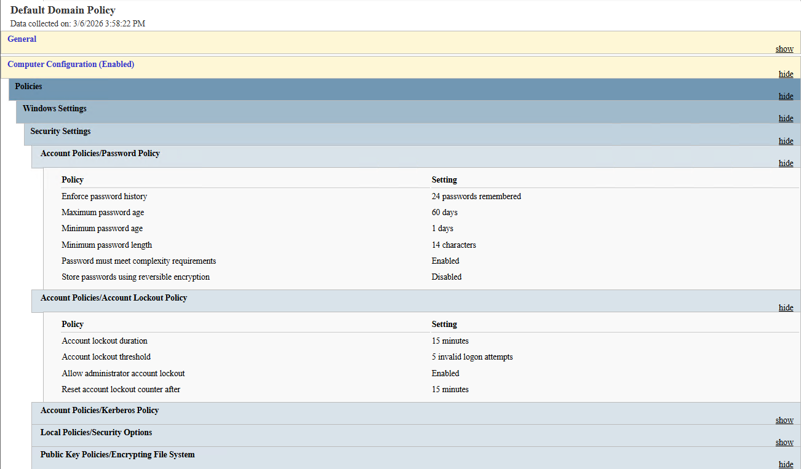
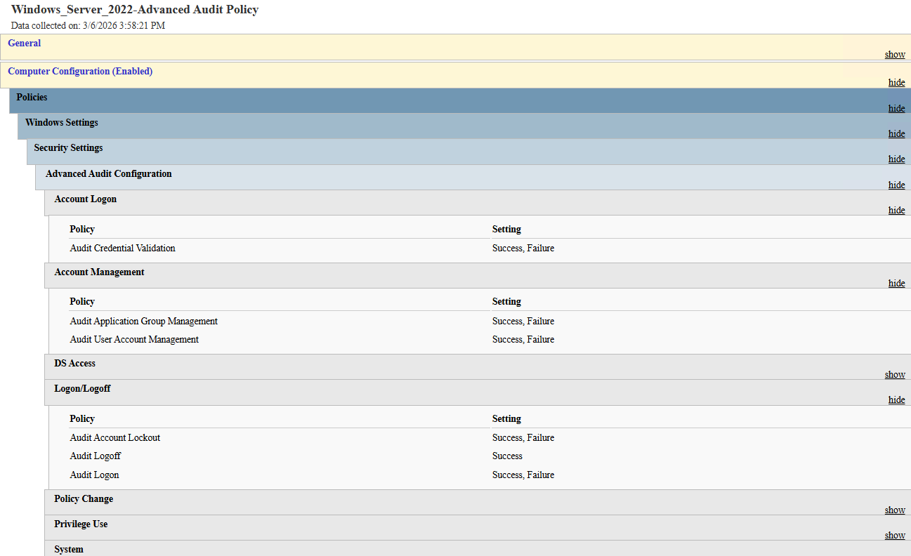
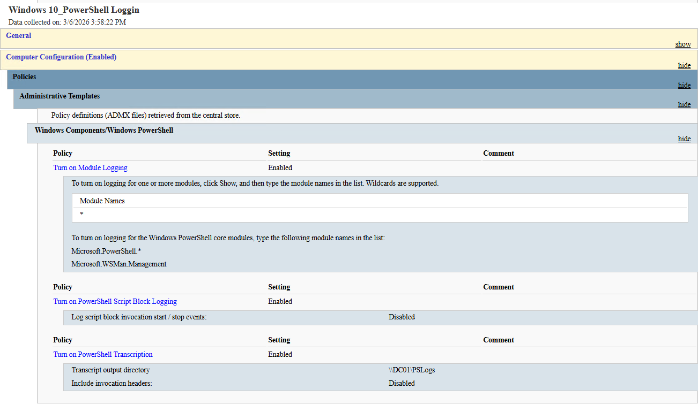
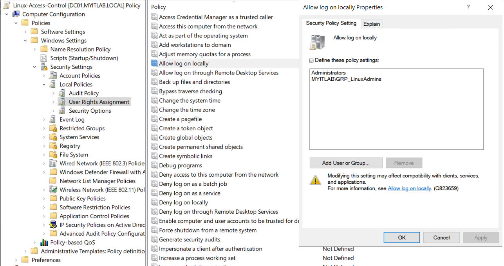
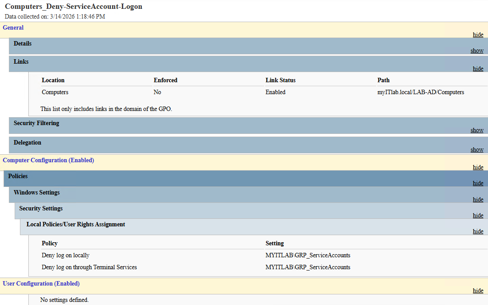
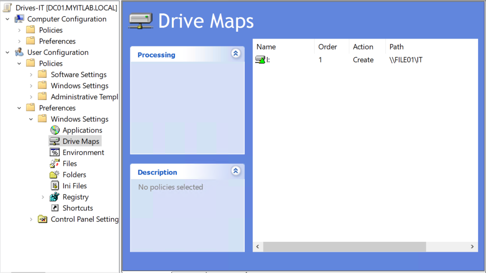
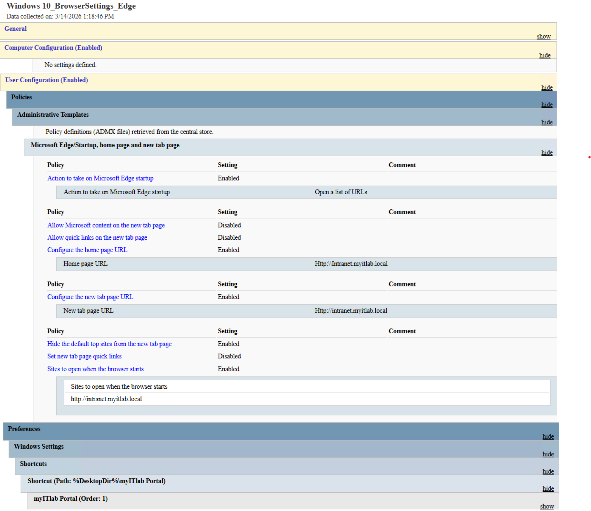

# Group Policy Object (GPO) Projects

This document details the core Group Policies implemented in the `myITlab.local` environment. These policies were designed following principle of least privilege, Microsoft Security Baselines, and organizational requirements.

---

## 1. Default Domain Policy (Password & Account Lockout)
**Goal:** Establish a baseline security standard for all user accounts across the domain to protect against brute-force attacks.
*   **Scope:** Linked to the root domain (`myITlab.local`).
*   **Key Configurations:**
    *   Enforced strong password complexity requirements.
    *   Configured Account Lockout Policy (e.g., locking accounts after a set number of failed attempts).
*   **Why it matters:** Ensures that every single user, regardless of their department OU, is held to a minimum cryptographic standard.

  
   
  <em>Evidence: GPO Report validating the password and account lockout configurations.</em>

---

## 2. Advanced Audit Policy (Security Monitoring)
**Actual GPO Name:** `Windows_Server_2022-Advanced Audit Policy`
**Goal:** Increase visibility into critical infrastructure changes and privileged account usage.
*   **Scope:** Linked to the `Servers` OU.
*   **Key Configurations:**
    *   Enabled auditing for "Security Group Management" (to track when users are added/removed from admin groups).
    *   Enabled "Logon/Logoff" subcategories to track privileged access.
*   **Verification:** Validated by capturing Event ID 4728 on DC01 when adding a user to `GRP-Servers-Admin`. *(See [Auditing Evidence](Auditing-Evidence.md) for screenshots).*

  
   
  <em>Evidence: Evidence: GPO Settings report showing advanced auditing configured to capture privileged events..</em>

---

## 3. Windows 10 Security Baseline & PowerShell Logging
**Goal:** Harden endpoint workstations and provide forensic visibility into script execution.
*   **Scope:** Linked to the `Workstations/Windows` OU.
*   **Key Configurations Applied:**
    *   **PowerShell Logging:** Enabled Module Logging and Script Block Logging.
    *   **BitLocker & Credential Guard:** Configured via `MSFT Windows 10 22H2` policies to protect data at rest and prevent pass-the-hash attacks.
    *   **Defender Antivirus:** Standardized scan schedules and definitions.
    *   **Protocol Hardening:** Disabled legacy protocols like SMBv1 and hardened NTLM/LDAP.

  
   
  <em>Evidence: Endpoint hardening policy including PowerShell logging to improve threat visibility.</em>

---

## 4. Linux Access Control
**Goal:** Centralize authentication and restrict local logon access for Linux endpoints using Active Directory.
*   **Scope:** Linked to the `Workstations/Linux` OU.
*   **Key Configurations:**
    *   Granted "Allow log on locally" rights to the `GRP_LinuxAdmins` group and the built-in `Administrators` group.
    *   *Note: The built-in Administrators group was retained to ensure emergency "break-glass" local access in the event of domain disconnection.*
    *   Enforced via SSSD (`ad_gpo_access_control = enforcing`) on the Fedora client.
*   **Why it matters:** Demonstrates cross-platform enterprise management, ensuring standard Windows domain users cannot access Linux infrastructure.

  
   
  <em>Evidence: AD policy restricting local logon access, which is enforced via SSSD on the Linux endpoint</em>

---

## 5. Service Account Hardening & Least Privilege
**Actual GPO Names:** `Computers_Deny-ServiceAccount-Logon` and `Users_ServiceAccount-Restrictions`

**Goal:** Prevent service accounts from being used interactively by threat actors and restrict their session capabilities in the event of a breach.
*  **Scope:** 
    *   *Computer Policy:* Linked to the parent `Computers` OU (inherits down to all `Servers` and `Workstations`) and the `DomainControllers` OU.
    *   *User Policy:* Linked to the `Service Accounts` OU.
*   **Key Configurations Applied:**
    *   **Logon Denial (Computer Config):** Applied "Deny log on locally" and "Deny log on through Terminal Services" for the `GRP_ServiceAccounts` group to ensure these accounts can only run background services, not interactive desktops.
    *   **Session Lockdown (User Config):** Enabled "Prevent access to the command prompt" and restricted allowed applications, ensuring that even if a session is established, the account cannot be weaponized for lateral movement.
*   **Why it matters:** Splitting these policies demonstrates an understanding of GPO scoping (applying User Rights Assignments to machine OUs vs. applying Administrative Templates to user OUs) while adhering to strict zero-trust principles.

  
   
  <em>Evidence: Machine-level policy preventing interactive desktop access for all service accounts across the domain.</em>

---

## 6. Edge Browser Config & Department Drive Maps
**Actual GPO Names:** `Windows 10_BrowserSettings_Edge` and `Drives-IT` (Example)

**Goal:** Improve user experience and standardize the operating environment for standard users based on their role.
*   **Scope:** Linked to specific department OUs (e.g., `Users/IT`, `Users/Sales`).
*   **Key Configurations (Group Policy Preferences):**
    *   Mapped specific network drives based on department (e.g., Drive `I:` for IT, Drive `S:` for Sales) pointing to targeted shares on `FILE01`.
    *   Standardized Microsoft Edge startup pages and created a desktop shortcut for the "myITlab Portal".
*   **Why it matters:** Demonstrates practical sysadmin skills related to daily user productivity, file server access control, and the use of Group Policy Preferences (GPP) over legacy logon scripts.

  
   
     <em>Evidence: Example of GPP Drive mapping for the IT department.</em>
    
    
  
   
  <em>Evidence: Standardized Edge browser configuration.</em>

