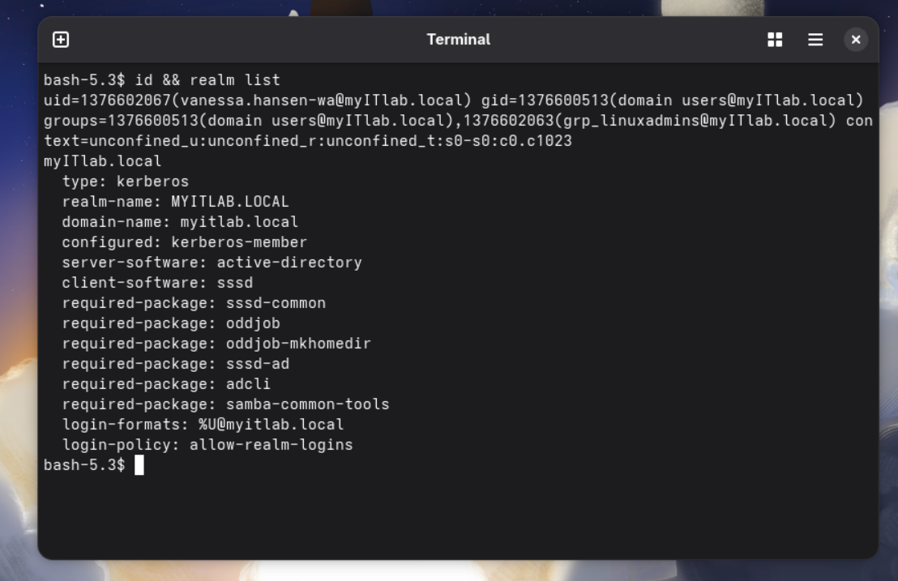

<div align="center">
  <h1>🔐 Enterprise Linux Integration with Active Directory (SSSD & Realmd)</h1>
  <p>
    
    
    
    
  </p>
</div>

<hr>

## 📌 Project Overview
**Objective:** Implement centralized identity management by integrating a Fedora Linux workstation (`GAN-WS-003`) into a Windows Server Active Directory domain (`myITlab.local`). 

**Outcome:** Successfully joined the Linux machine to the domain, enabled Active Directory users to authenticate using their domain credentials, and enforced Windows Group Policy Objects (GPOs) to strictly control Linux login access based on AD group membership.

---

## ⚙️ Implementation Steps

### 1. Domain Join & Core Configuration
Utilized `realmd` to discover the Active Directory domain and seamlessly join the Fedora workstation. Configured the SSSD daemon to map Windows user attributes to Linux POSIX attributes automatically.

```bash
# Example commands used for domain join and configuration
sudo realm discover myITlab.local
sudo realm join myITlab.local -U Administrator
```
### 2. Automated Workspace Provisioning
Enabled PAM (Pluggable Authentication Modules) to automatically generate a /home/user directory for network accounts upon their first local login.

```bash
sudo authselect enable-feature with-mkhomedir
```
### 3. Implementing GPO-Based Access Control
Configured /etc/sssd/sssd.conf to respect Windows Group Policy by enforcing ad_gpo_access_control. Created a dedicated Active Directory security group (GRP-LinuxAdmins) and configured Windows GPO User Rights Assignment (Allow log on locally and Allow log on through Remote Desktop Services) to specifically permit the admin group while denying standard users.

### 🛠️ Advanced Troubleshooting & Problem Solving
During the integration, I encountered and successfully resolved several complex cross-platform authentication issues.

<details> <summary><b>🚨 1. Stale Kerberos SIDs & Cache Invalidation</b></summary> <br>
The Problem: When an AD user was deleted and recreated, SSSD cached the old Security Identifier (SID), resulting in persistent "Access Denied" errors despite correct group assignments.

The Fix: Diagnosed the caching failure and systematically purged the internal SSSD database, destroyed Kerberos tickets, and forced a fresh AD sync.

```bash
sudo systemctl stop sssd
sudo rm -rf /var/lib/sss/db/* /var/lib/sss/mc/*
sudo kdestroy -A
sudo sss_cache -E
sudo systemctl start sssd
```
</details> <details> <summary><b>🚨 2. Cross-Platform GPO Parsing Remediation</b></summary> <br>
The Problem: Valid AD users began receiving default "Access Denied" messages. By enabling deep debug logging and analyzing SSSD trace logs (sssd_myitlab.local.log), I identified that a higher-level Service Account GPO contained Windows-specific .inf formatting that was crashing the Linux .ini text parser (iniconfigparse failed 5). When the parser fails, SSSD defaults to blocking all logins for security.

The Fix: To fix the parser crash without modifying the parent Windows policy, I utilized Advanced Security Settings in AD Group Policy Management. I exposed hidden Computer objects in the directory picker and applied a strict Deny: Apply group policy rule for the Linux machine (GAN-WS-003$) on the incompatible GPO, restoring full authentication functionality.

</details> <details> <summary><b>🚨 3. SSH GPO Permission Mapping</b></summary> <br>
The Problem: Users granted the "Allow log on locally" right via GPO were still being rejected by SSSD when attempting to SSH into the machine.

The Fix: Identified that SSSD maps Windows GPO rights strictly. Remote SSH access requires the Allow log on through Remote Desktop Services right in AD. Updated the GPO accordingly.

</details>


## 💻 Common SSSD/Fedora Commands Used

| Command | Description | Example Usage |
| :--- | :--- | :--- |
| `ls -l [path]` | Lists directory files to find specific log filenames. | `sudo ls -l /var/log/sssd/` |
| `grep -i [text] [file]` | Searches for specific text (case-insensitive) in a file. | `sudo grep -i "gpo" /var/log/sssd/sssd_myitlab.local.log` |
| `grep [text] > [file]` | Redirects output to a text file instead of the screen. | `sudo grep -i "gpo" ... > ~/results.txt` |
| `sss_cache -E` | Clears the SSSD cache, forcing a refresh from AD. | `sudo sss_cache -E` |
| `kdestroy -A` | Destroys all Kerberos tickets for a clean state. | `sudo kdestroy -A` |
| `id [username]` | Displays a user's UID, GID, and AD groups. | `id vanessa.hansen-wa@myitlab.local` |
| `realm list` | Shows Active Directory domain details. | `realm list` |
<br>

### ✅ Validation & Results
The integration was successfully validated by logging into the Fedora workstation as the standard Active Directory user vanessa.hansen-wa@myitlab.local.

The screenshot below demonstrates the successful domain join (realm list) and verifies that the Linux system is successfully pulling the user's UID, GID, and Active Directory group memberships via SSSD (id).

<div align="center">  <br> <i>Terminal output confirming domain status and successful AD user authentication.</i> </div> ```
